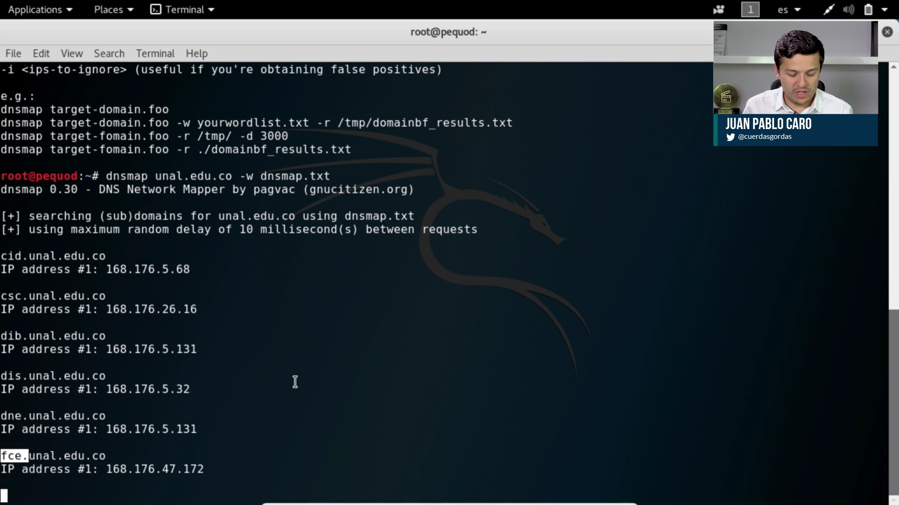

*En la terminal de kali escribimos _host unal.edu.co_*
Este comando nos mostrara la ip de este nombre de dominio

con _dnsenum_ podemos listar todos los subdominios de este dominio

con _dnsmap_ un ataque de fuerza bruta al dns
ingresamos a el fichero donde se encuentran los diccionarios con:
`cd /usr/share/wordlists`

copiamos el dnsmap y lo llevamos al directorio de inicio con el mismo nombre para no afectar el original
`cp dnsmap.txt ~/dnsmap.txt`

luego nos dirigimos a la carpeta donde se ha copiado
`cd ~/`

y listamos
`ls`

este diccionario contiene combinaciones de letras de longiitud de 3 comunes

enntonces utilizamos dnsmap con el parametro _-w_ para cargar el diccionario
`dnsmap unal.edu.co -w dnsmap.txt`

Lo que hara es probar los subdominios que talvez no esten indexados que le ingresamos en el diccionario con el dominio que introducimos

*nslookup* es una herramienta que tiene su propia linea de comandos

cuando hablamos de registro _MX_ son servidores de correo

utilizamos el comando `nslookup` para ingresar

seteamos el servidor dns `server 8.8.8.8` en este caso el de google

seteamos el tipo de registros que deseamos obtener `set type=any` en este caso cualquier registro

y mandamos el dominio `unal.edu.co`