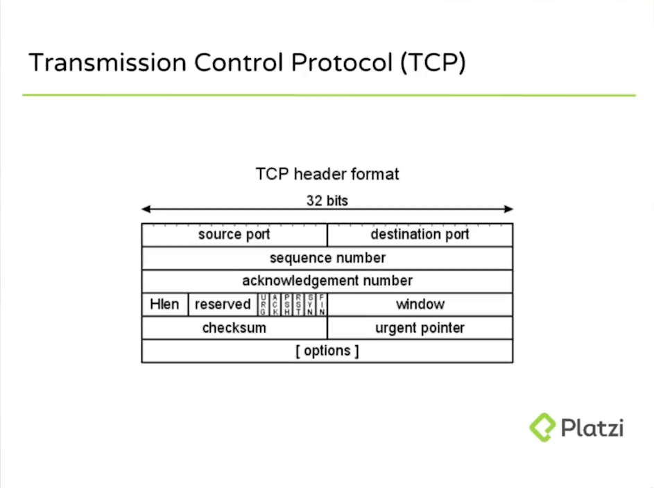
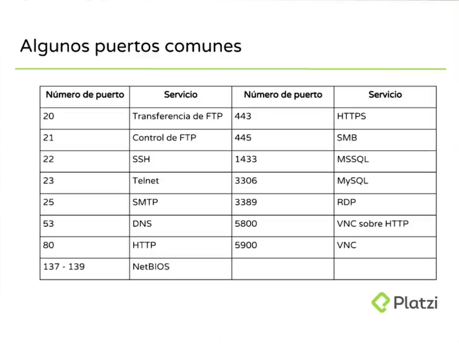

Para cada uno de los servicios de auditorio tenemos 4 fases:

* Determinar si un sistema está encendido.

Generalmente se hace a traves de un ping

* Hacer escaneo de puertos.
* Obtener información de servicios.
* Escanear vulnerabilidades.

### Protocolos de comunicacion

#### UDP(User Datagram Protocol)

Es el modelo de comunicacion mas simple en donde uno de los dos extremos le envia informacion al otro continuamente y no recibe confirmacion, se ve en servicios como streaming
en cosas que no es importante que se pierdan paquetes mientras se siga haciendo la transmision.

#### TCP(Transmission Control Protocol)

Con este nos aseguramos que se comunican, nos aprovecharemos de el three way handshake
lo primero que se tiene es un puerto fuente y un puerto destino(existen un poco mas de 65k de puertos)

Lo primero que hace el protocolo tcp es enviar un paquete _syn_(sincronizacion), la otra maquina responde _syn-ack_(reconocimiento de sincronizacion), en donde la maquina de origen(la que envio el primer paquete) responde con un _ack_(reconocido)

#### Algunos puertos comunes

Es normal encontrar que muchos de los administradores de los servidores desactivan estos puertos por defecto y activan estos servicios en otros puertos