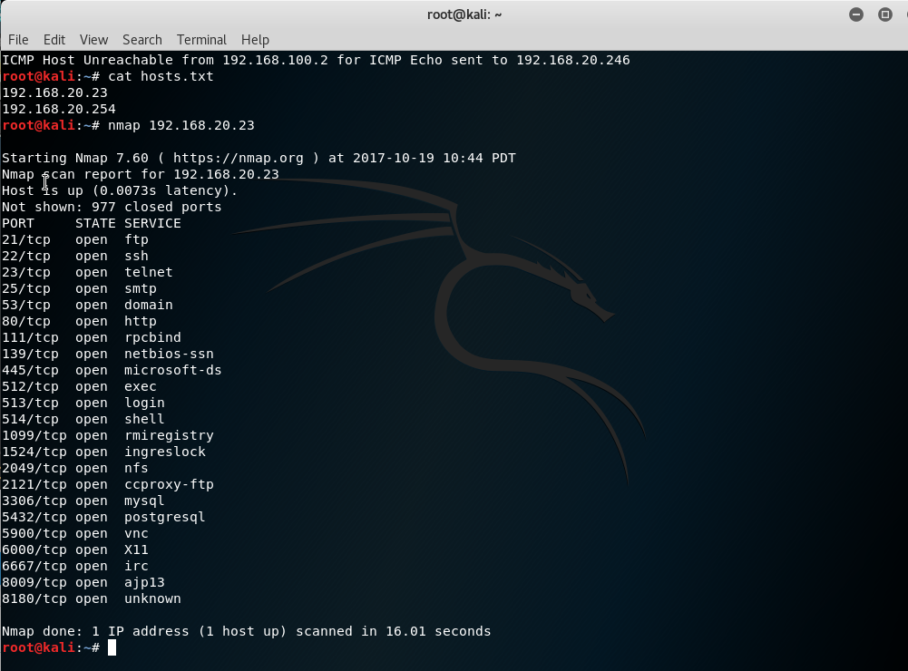

# Usando _fping_ y _nmap_

No todas las maquinas que esten encedidas necesariamente responderan a un ping(firewall o politica), utilizamos el protocolo ismp

## fping

La opcion `-a` nos ayude a ver los resultados de servidores que estan vivos 

La opcin  `-g` que genera un rango de ips

La forma de utilizarlo `fping -a -g 192.168.20.1 192.168.20.254 > hosts.txt`. Lo que estamos haciendo con este comando es hacerle ping a las direcciones que esten entre _20.1 y 20.254_ y la salida la guarda en un archivo llamado _hosts.txt_

## Nmap

La base de nmap es hacer mapeo de redes atravez del descubrimiento de puertos y de otros hosts en diferentes sistemas o entornos

El comando simple es `nmap 192.168.20.23`
Por default solo escaneo los 1000 puertos mas comunes, lo que es es comun que los administradores cambien de puertos los servicios 

el tiempo es clave en nmap en un host pequeño como el del laboratorio tarda alrededor de 16s

Deducimos de _Nmap_ lo primero que arroja la latencia

No muestra la cantidad de puertos que estan cerrados en este caso _977_

Cuando un puerto esta abierto es por que esta dispuesto a recibir peticiones atravez de ese numero de puerto

Ahora con este comando nmap buscara en mas puertos

`nmap -Pn -p- 192.168.20.23 > nmap_scan.txt`

***-Pn*** es para saltarse la fase de descubrimiento, puede que la maquina no responda a ping pero si este prendida

***-p-*** con este le decimos a nmap que recorra los 65.000 puertos

y con `> nmap_scan.txt` le decimos que guarde la salida en ese archivo

Con el comando `nmap -p58175 192.168.20.23` con este comando escanearemos unicamente el puerto que le pedimos