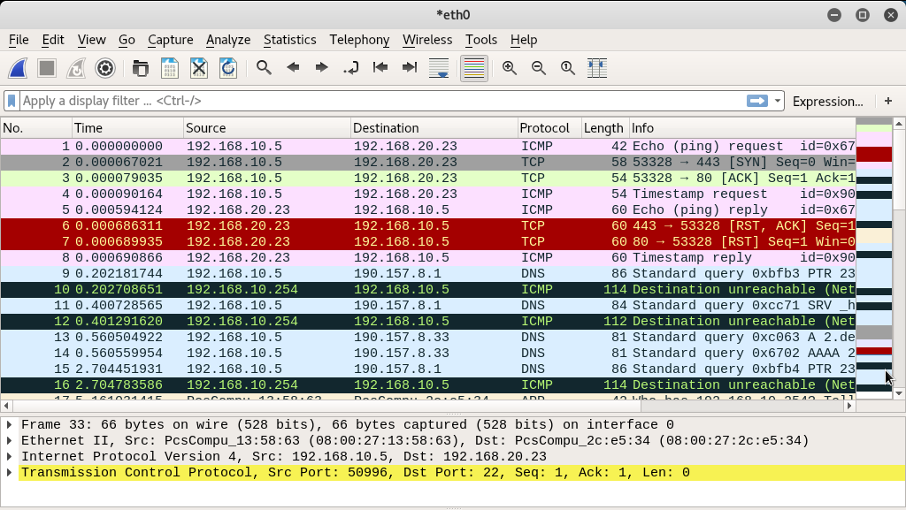
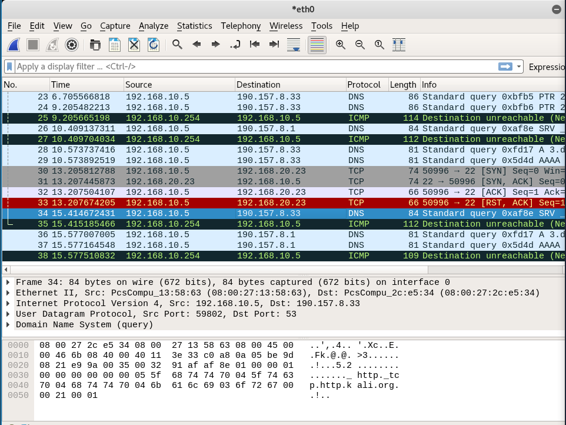
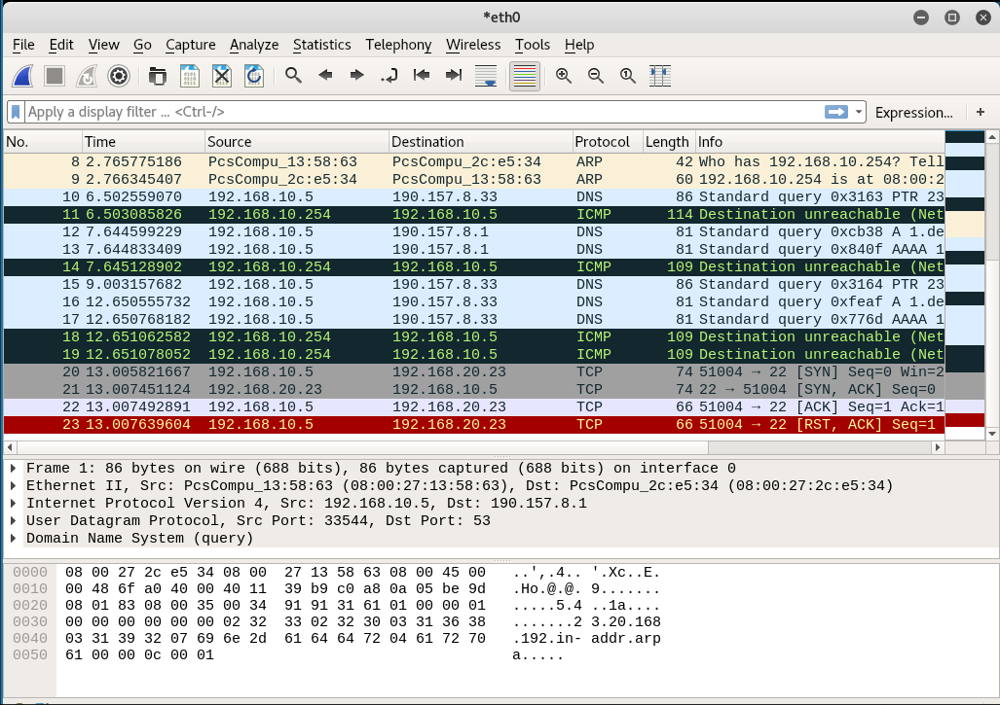

Análisis aun puerto en especifico

`nmap -p22 -sT 192.168.20.23`

con `-s` le decimos el tipo de conexion que quiero iniciar y con `T` le decimos que queremos un saludo tcp completo, en vez de hacer lo de defecto que es syn y de vuelta recibe un paquete syn-ack

Abrimos el wireshark para mirar el trafico cuando ejecutemos nmap

En orden(Esto lo hara por default, a menos que le digamos que no lo haga, el ping):
1. El primer paquete plantea el ping a la otra maquina
2. Lo que hace que la maquina source envie un paquete [SYN]
3. La otra maquin contesta con un paquete [ACK] 
6. Por ultimo en la linea 6 nmap termina la conexion con paquetes(reset) [RST, ACK]

#### Mas adelante si hace lo que pedimos 

- En la linea 30 hace lo que le pedimos a nmap el [SYN], luego [SYN, ACK], luego [ACK] y por ultimo Nmap resetea la conexion con un [RST, ACK]

Lo que es mejor es utilizar nmap sin la fase de discovery para descubrir puertos aunque la la maquina no responda a un ping

`nmap -p22 -sT -Pn 192.168.20.23`

Podemos ver que hace unicamente lo que pedimos y la peticion es mucho mas veloz