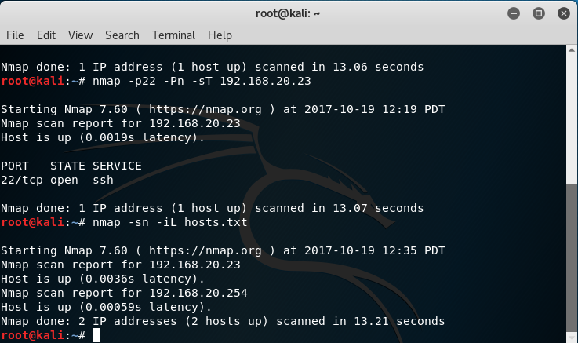
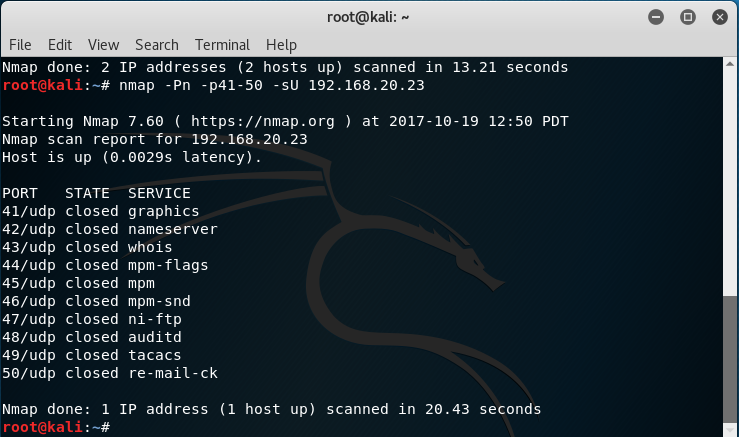

Teniendo en cuenta los hosts que respondieron a mi fping en el archivo _hosts.txt_
podemos hacer el sgte comando para que recoja los puertos de los hosts del archivo que le pasemos

`nmap -sn -iL hosts.txt`

+ el parametro _-sn_ hace coso haga el ping en busca de respuesta del host unicamente
* el parametro _-iL_ hace que coja como fuente el archivo que se le indica en este caso _hosts.txt_

#### #Cabe destacar que este comando es mas lento que el fping

Otra forma de utilizar nmap con varias direcciones a la vez es en un rango

`nmap -sn 192.168.20.20-25`

O con todo el segmento

`nmap -sn 192.168.20.0/24`

Recordemos que UDP es tipo stream asi que no hara confirmacion de que lo que le enviamos solo continuara enviando paquetes

En Nmap:

`nmap -Pn -p41-50 -sU 192.168.20.23`

+ Saltamos la fase de discovery con  ___-Pn___
+ Ponemos los puertos que queremos en este caso en rango desde el _41 al 50_ con ___-p41-50___
+ Para que utilice el protocolo UDP utilizamos ___-sU___

+ La mayoria de puertos estan cerrados
+ Existe uno que puede estar filtrado cuando no responde puede ser por firewall

 #Nmap hace un escaneo de puertos por default de los 1000 mas comunes **Cuando esta por TCP**, cuando es **UDP utiliza los 65.000 puertos**
