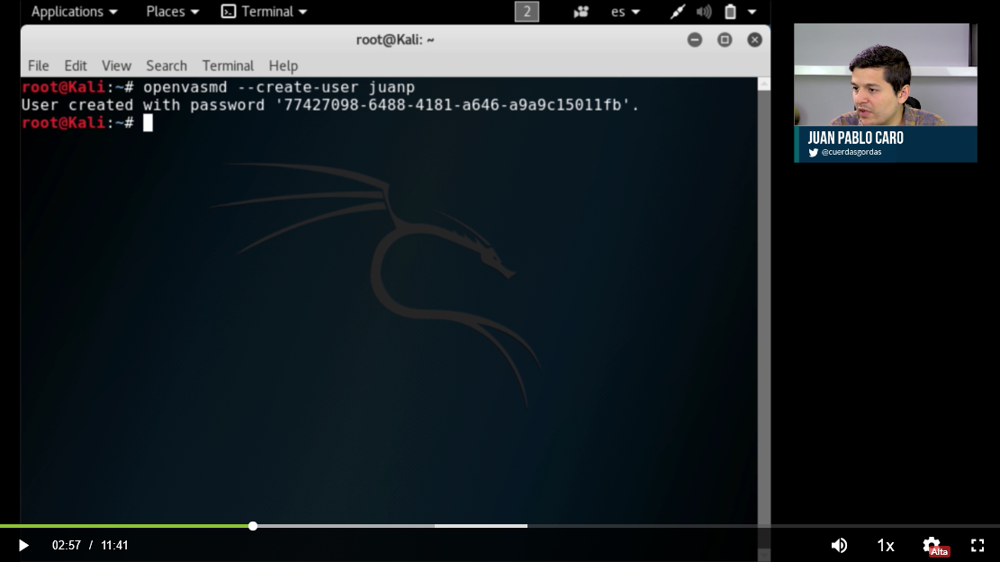
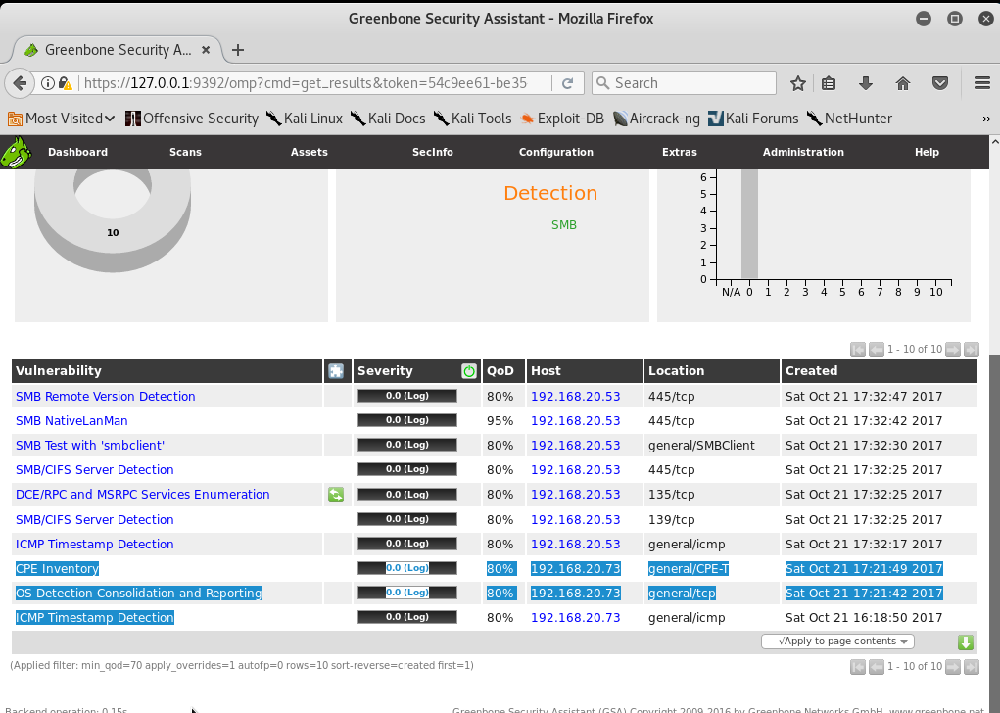
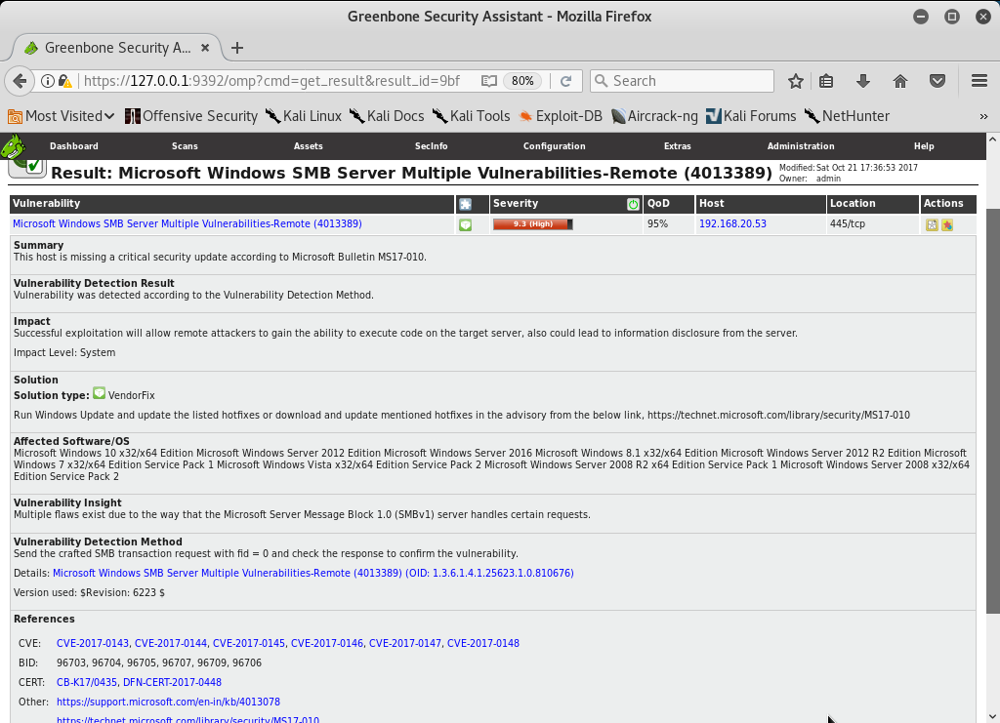
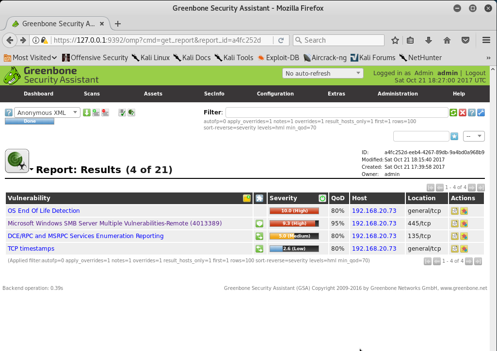

# OpenVAS

Digamos que _OpenVAS_ es la version gratuita de _Nessus_

Para iniciar el trabajo con openvas se utiliza `openvas-setup` lo que hara es actualizar y configurar openvas

Por si se necesita para crear un usuario nuevo en openvas se utiliza 

`openvasmd --create-user juanp`

En caso de que los servicios de openvas no esten iniciados podemos utilizar

`/etc/init.d/openvas-manager start`
`/etc/init.d/openvas-scanner start`

Despues de ello al igual que _Nessus_ openvas trabaja con un servidor web que se encuentra en la url `https://127.0.0.1:9392`

La forma de trabajar es muy similar se trabajan con scans 
para hacer un scan podemos ir a la pestaña de scans y dar en tasks

### El usuario por defecto es **admin** y la clave es la que genera cuando se hace el setup por primera vez

## En mi maquina virtual con 2 de ram y el procesador por defecto tardo alrededor de 10 a 15 min iniciando el proceso **openvas-setup**, al parecer el que se cuelga es el procesador junto con la velocidad de transferencia del disco

Cabe aclarar que en el dashboard principal muestra la topologia de red

Un scan sencillo de tipo _full and fast_ hacia un solo host se me ha demorado alrededor de 
90 mins a una maquina win7 con el firewall encedido que solo recibia mensajes icmp(ping) debidoa a esta configuracion solo pude encontrar esto, 3 registros de este host y 0 vulnerabilidades

He hecho el mismo escaneo a la maquina winxp con el firewall apagado y se ha demorado tan solo 9 mins

Para acceder a los reportes entramos a la pestaña de scans y en reports y escojemos la ip de los reportes que ya se ha generado

### Reporte de Win XP(Sin firewall)

_Esta vulnerabilidad es la que utilizare_

He vuelto a hacer el escano a win7 sin firewall.
### Reporte de Win 7(Sin firewall)

He hecho el mismo escaneo a la maquina win7 con el firewall apagado y se ha demorado tan solo 
36 mins

He de trabajar con la misma vulnerabilidad que se ha detectado en winxp, en lecciones posteriores se puede ver cual es

