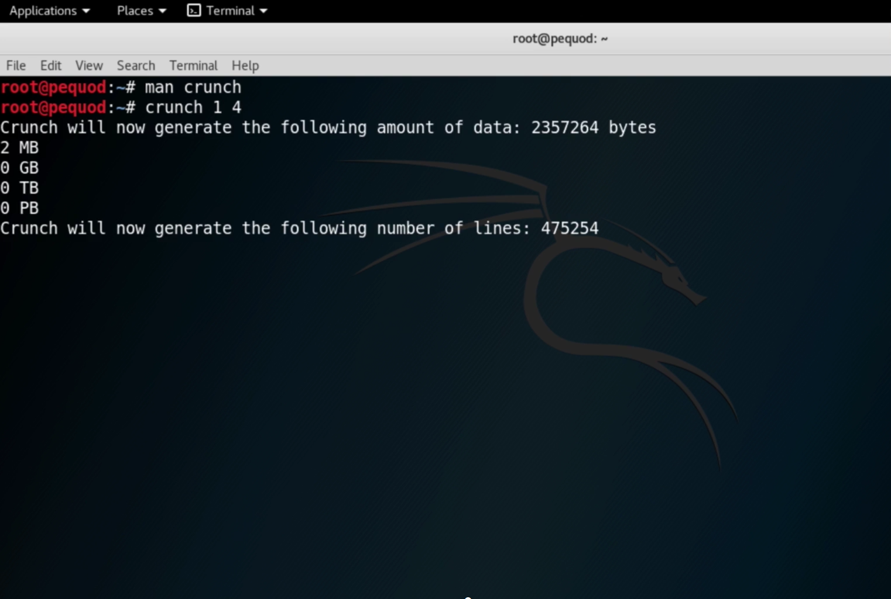
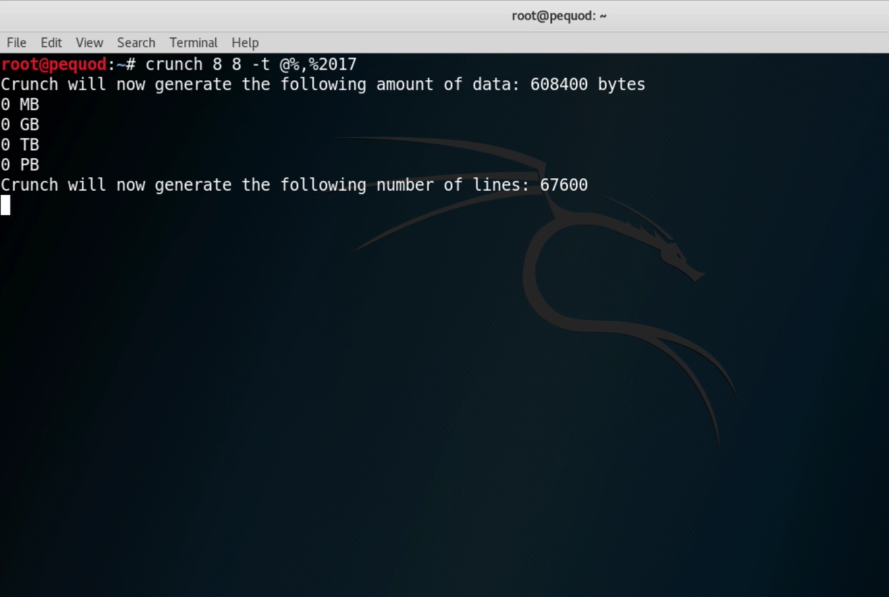
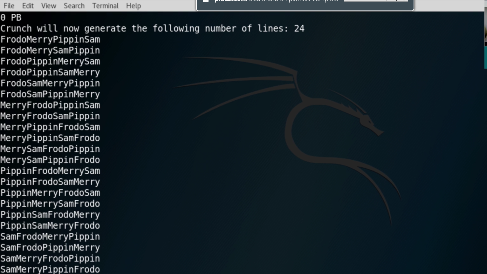

# Romper una contraseña

Normalmente las contraseñas se encuentran hash.

_Un ***HASH*** es una funcion matematica no reversible, lo que implica que con el resultado no puedo obtener ninguna informacion acerca de la fuente o de la informacion original_

_Lo que permite almacenar una firma que se puede asegurar que es unica pero que en ningun momento expone la contraseña original, con lo cual nadie sabra cual es la clave original_

## Como crear un diccionario para atacar los algoritmos HASH

Miraremos que herramientas nos permiten crear diccionarios combinando palabras, y caracteres para poder hacer estos ataques

Existen dos tipos de ataques para romper contraseñas

1. __Ataques de fuerza bruta__ estos ataques prueban con todas las combinaciones de caracteres que puedan haber, como un candado con 4 digitos, comenzariamos en 0,0,0,0 e iriamos probando en el camino a el 9,9,9,9 eventualmente encontrariamos la clave

2. __Ataque con diccionarios__ estos ataquen utilizan la mezcla de diferentes palabras para romper la contraseña, puede ser combinando palabras con numeros o algo similar

### Nota
Un keyspace es todo el espacio o universo de combinaciones que aceptan una contraseña el keyspace de un candado de 4 digitos seria en este caso de 10000 combinaciones, por que van desde 0,0,0,0 hasta el 9,9,9,9

## Utilizando Crunch
Podemos escribir `man crunch` para ver el manual de este.

Vemos que genera una lista de palabras a partir de un conjunto de caracteres

`crunch 1 4`

Esto generaria un lista de palabras que comiencen con un caracter y terminen con 4 y que me realice todas las combinaciones del abecedario con letras minusculas

    En la imagen podemos ver el tamaño de la lista de palabras que se genero y cuantas lineas genero

`crunch 1 4 aeiou`
Esto generaria un lista de palabras que comiencen con un caracter y terminen con 4 y que me realice todas las combinaciones de las letras a,e,i,o,u

Archivo crucial que tiene las posibles definiciones de caracteres de crunch utilizando el comando 

`less /usr/share/crunch/charset.lst`

### Utilizando wildcards o comodines para crear un diccionario

- Con la opcion _8 8_ decimos que queremos unicamente palabras de 8 caracteres
- El @ es una letra MINUS
- La , va a ser una letra MAYUS
- El % es un numero
- En este caso no esta pero el ^ inserta simbolos

### Generar palabras sin desorganizarlas
`crunch 1 1 -p Sam Frodo Merry Pippin`
genera combinaciones que repiten caracteres o palabras solo una vez

Lo que genera 

`crunch 1 1 -q text.txt`
Coje como entrada el archivo de texto para hacer el diccionario

`crunch 2 5 1234567890 -o pass.txt`

Con esto le dije a crunch que queria las combinaciones desde 3 caracteres hasta 5 con los numeros del 1 al 0 y que los guarde en el archivo pass.txt