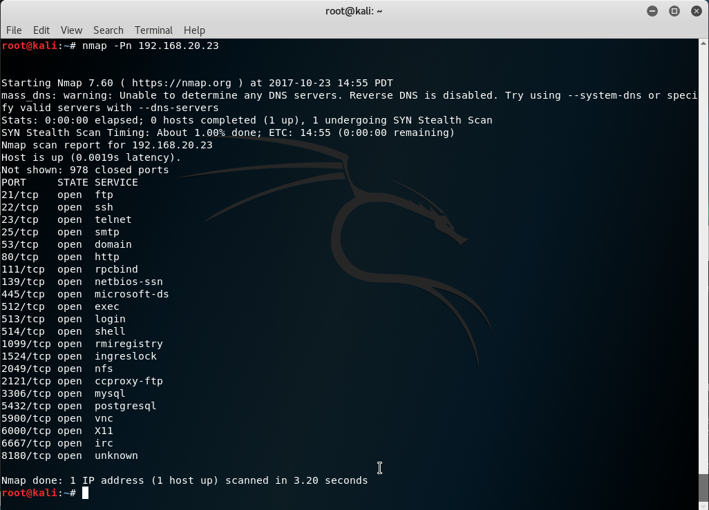
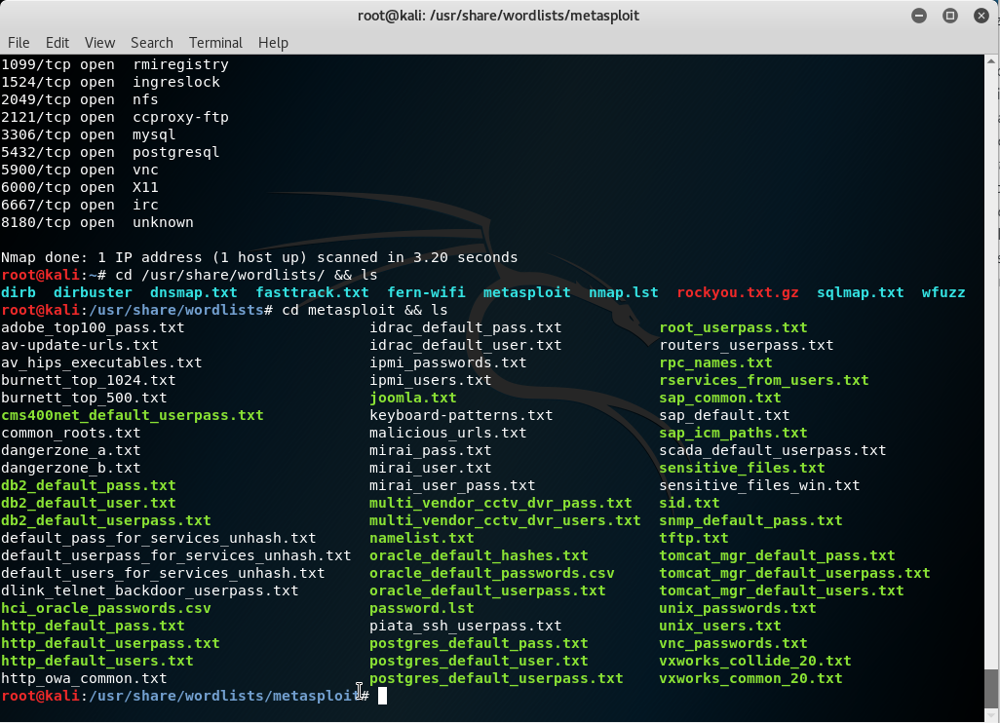
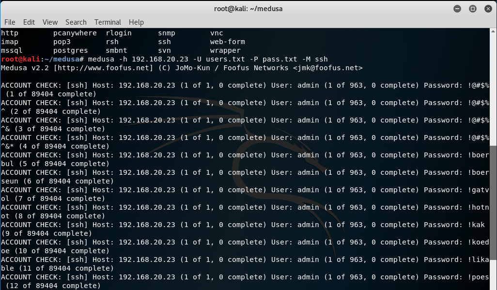

Ataque a sistemas remotos, a un servicio remoto como ftp, o ssh

con nmap 
`nmap -Pn 192.168.20.23`
- La direccion a la que apunta es la maquina metasploitable

Analizando lso puertos abiertos le haremos un ataque de fuerza bruta al ssh de este host con ___MEDUSA___

___MEDUSA___ es una herramienta que busca la contraseña de servicios, apartir de fuerza bruta o diccionarios para probar autenticacion hasta que pueda
## MEDUSA
1. Creamos un directorio donde guardar todo lo que utilizaremos(diccionarios) con `mkdir medusa`
2. Ahora nos dirigimos a el directorio donde Kali tiene ciertos diccionarios para hacer fuerza bruta `cd /usr/share/wordlists/ && ls`, y dentro de esta ubicacion hay una carpeta _metasploit_ que contiene diccionaros que nos incumben como son __unix_users.txt__ y __unix_passwords.txt__ que contienen palabras que normalmente se utilizan a la hora de configurar servicios tanto usuarios como passwords respectivamente

Un lemario es la coleccion de palabras en un idioma es muy bueno para hacer ataques

Entonces copiaremos varios dicionarios a la carpeta qeu creamos con

`cp password.lst ~/medusa`

`cp unix_users.txt ~/medusa`

`cp unix_passwords.txt ~/medusa`

`cp default_users_for_services_unhash.txt ~/medusa`

Volvemos a la carpeta medusa

`cd ~/medusa`

Lo que vemos es que tenemos dos archivos de usuarios y dos archivos de passwords, por lo que los concatenamos con cat

`cat default_users_for_services_unhash.txt unix_users.txt > users.txt`

`cat password.lst unix_passwords.txt > pass.txt`

Ahora si utilizaremos medusa, veremos el manual con `man medusa`

El fundamento de un ataque de fuerza bruta es intentar todas las combinaciones de usuario y password, la naturaleza de un ataque de diccionario es simplificar lo anterior con palabras de comunes por defecto, __Una diferencia grande entre un ataque de fuerza bruta es que un ataque de fuerza bruta eventualmente llegara a obtener la clave, pero con un ataque de diccionario no necesariamente se resolvera asi__

entonces ejecutaremos `medusa -h 192.168.20.23 -U users.txt -P pass.txt -M ssh`

- _-h_ el host que atacara
- _-u_ es un valor unico mientras que -U es que voy a seleccionar un archivo, de los usuarios
- _-p_ es un valor unico mientras que -P es que voy a seleccionar un archivo, de los pass
- _-M_ es el puerto que atacaremos

- _-r_ este parametro es el que permite cambiar el tiempo entre intento e intento

**Medusa esperara un tiempo entre ataque y ataque por que algunos servicios identifican ataques por la cantidad de intentos en un corto tiempo**

Otra herramienta parecida es ___Hidra___
`man hidra` es bastante similar a ***Medusa***