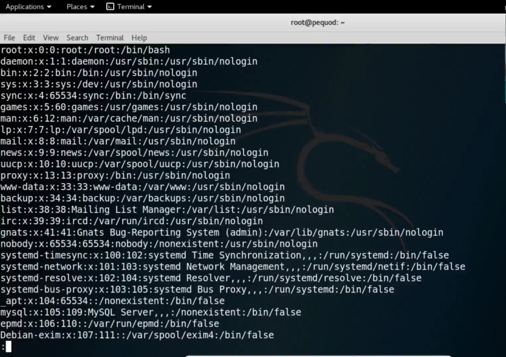
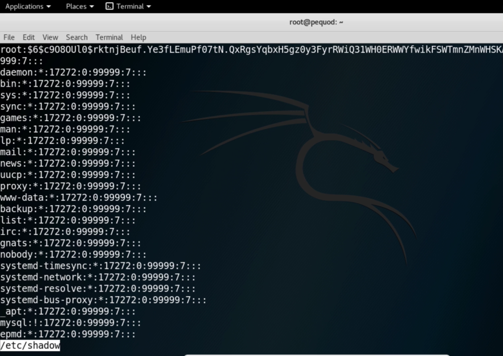
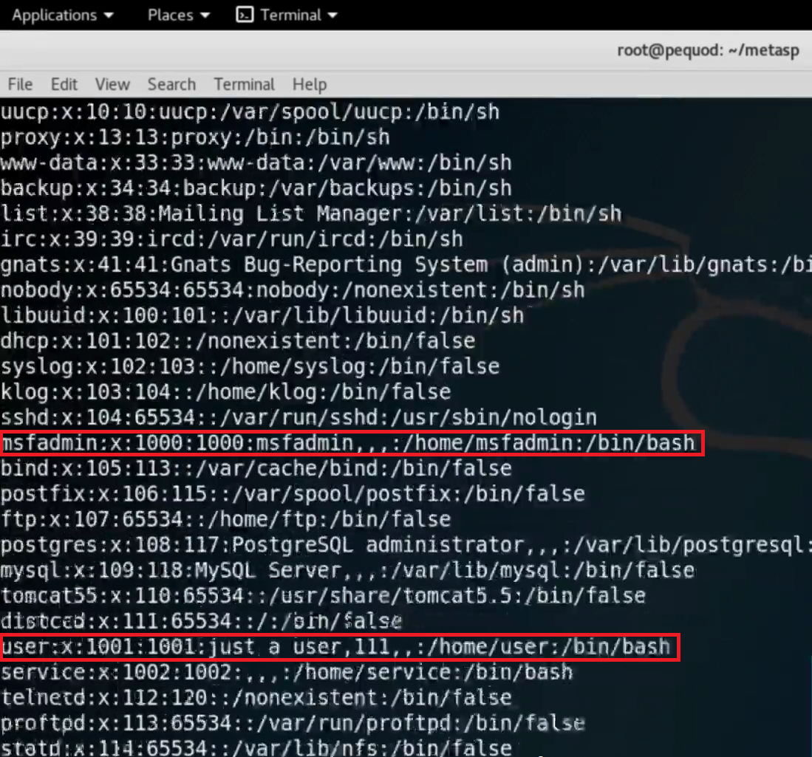
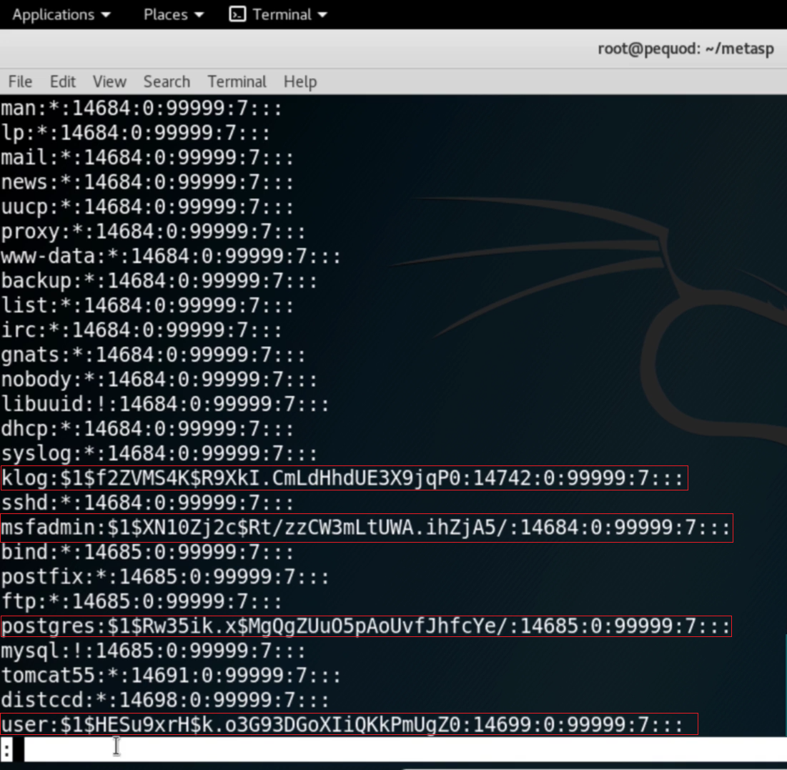
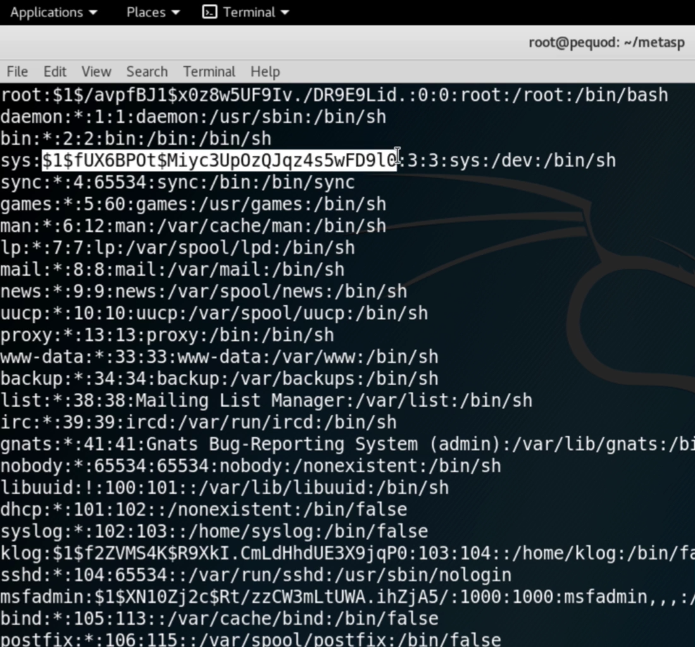
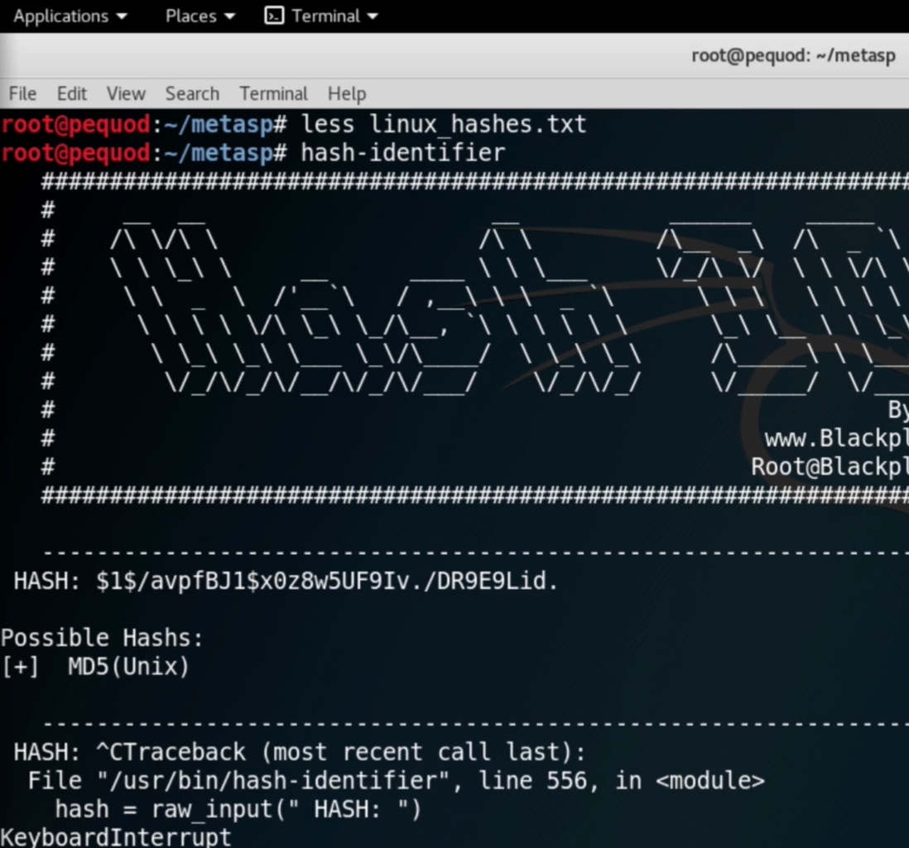

# Linux

Este ataque nos sirve para una maquina a la que tengamos acceso local con ciertos permisos , y lo que hacemos es sacar los archivos donde se almacenan los hashes para tratar de descifrarlos y obtener el acceso otros usuarios que nos puedan interesar esto se conoce como **Escalamiento de privilegios**

## Analizando como se almacenan los passwords en sistemas linux

### En la terminal
### Primero miro que tiene Kali
`less /etc/passwd`

Analizando la estructura de las lineas de izquierda a derecha:
* La primera palabra hacer referencia al nombre del usuario(ej: root, daemon, bin, sys, etc)
* En la segunda palabra(luego de los dos puntos) es la que corresponde al password, cuando aparece una '**X**' significa que el password esta cifrado, en algunos casos puede aparecer '**!**' esto significa que el usuario y el acceso esta bloqueado y la contraseña esta bloqueda y si tiene '**!!**' quiere decir que el usuario no tiene contraseña(en estos casos podriamos intentar ingresar unicamente con el usuario)
* La tercer palabra(numero) es el ID de usuario
* La cuarta palabra(numero) es el ID de grupo
* La quinta es una breve descripcion
* La sexta es la carpeta de inicio(home) el usuario
* La septima el shell por defecto que usa. la consola por la que se comunica

#### Este archivo `/etc/passwd` contiene informacion de los usuarios _pero no de los passwords, ni de los hashes_

`less /etc/shadow`

Este archivo lo que hace es almacenar el password cifrado de cada uno de los usuarios que tengan acceso

Analizando la estructura de las lineas de izquierda a derecha:

* Primer valor el nombre del usuario
* El segundo la contraseña o hash
* Tercero el numero de dias desde que se cambio la contraseña
* Cada cuanto se puede cambiar la contraseña min
* Cada cuanto se puede cambiar la contraseña max
* El numero de dias que euda antes que expire el password
* La cantidad de dias antes de que la cuenta sea bloqueada
* La cantidad de veces que la cuenta a sido bloqueada

El usuario root se puede ver que tiene el hash completo

Cuando son usuarios del sistema no muestra el hash

### Que tiene Metasploitable

`less /etc/passwd`

podemos ver que lo comun es que los usuarios creados aparecen con un id de usuario de 1000 mas o menos.

`less /etc/shadow`

Podemos ver que hay varios usuarios que tienen sus respectivos hashes

# Utilizando JhonTheRiper

JhonTheRipper es una herramienta de analisis criptografico que permite hacer ataques a hashes de diferentes formas, como funciona: El hace el hash apartir de un diccionario y lo compara contra el hash del archivo que queremos descifrar

Los hashes existen de varios tipos
- md5
- sha1
- sha2
- sha256

Entre otros

tambien el tiempo que demore en descifrar el hash depende mucho de la informacion, este programa es bueno cuando estamos trabajando con un keyspace pequeño como una palabra o una contraseña relativamente corta

`unshadow passwd.txt shadow.txt > linux_hashes.txt`

* Donde unshadow me permite arrancar el proceso de jhontheripper que lo que hace es que concatena el usuario con el hash respectivo
* passwd.txt es el archivo backup de el archivo _/etc/passwd_ de la maquina metasploitable
* shadow.txt es el archivo backup de el archivo _/etc/shadow_ de la maquina metasploitable
* y por ultimo la salida se envia al archivo _linux_hashes.txt_

Apartir de este resultado podemos cojer un hash, en este caso el del usuario root y arrancamos

`hash-identifier`

Que es un programa que viene en kali que se encarga de identificar el cifrado de un hash

ya aqui pegamos el hash del usuario root y le damos enter

Luego de esto vamos a utilizar un diccionario de los que copiamos en la carpeta medusa a la carpeta en la que tenemos el backup de metasploit

`cd ..`

`cd medusa`

`cp pass.txt ~/metasp/`

`cd ~/metasp/`

Ya estando sobre esta carpeta utilizamos 

`jhon --rules --wordlist=pass.txt linux_hashes.txt`

Donde introducimos el diccionario con el que queremos que ataque y el luego el archivo donde se encuentra el hash

Como podemos ver a descifrado la clave de 4 usuarios pero se ha cortado el proceso ya que el diccionario es bastante grande.