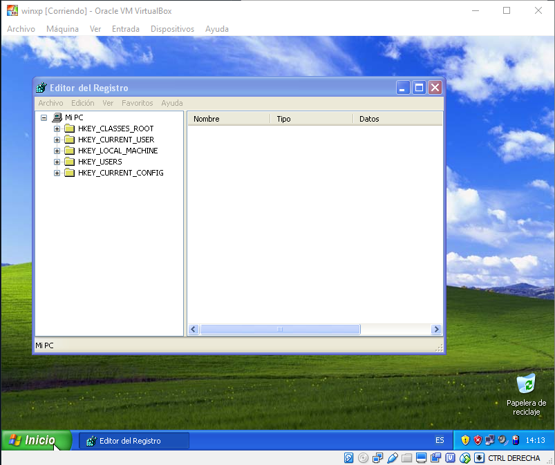
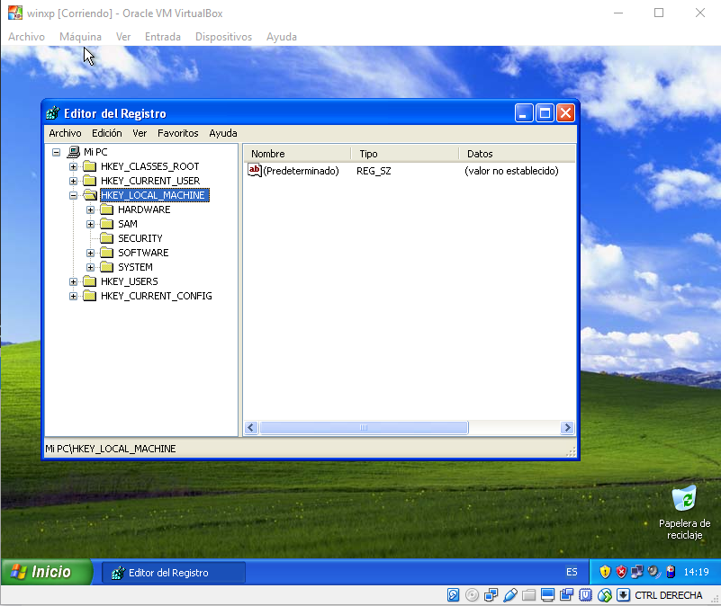
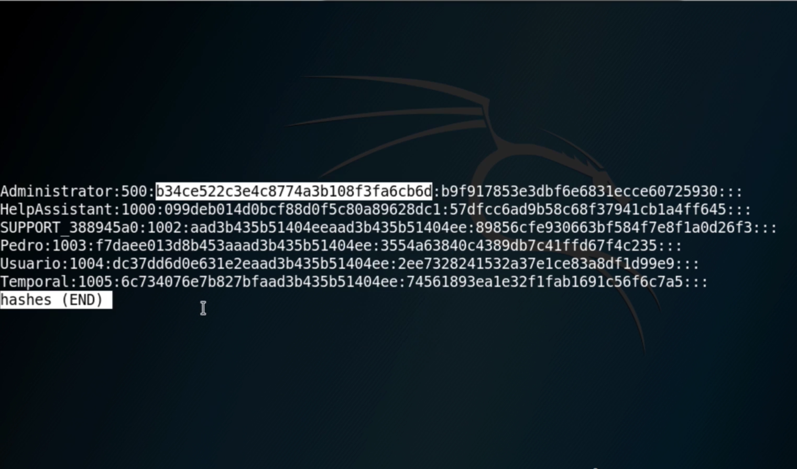
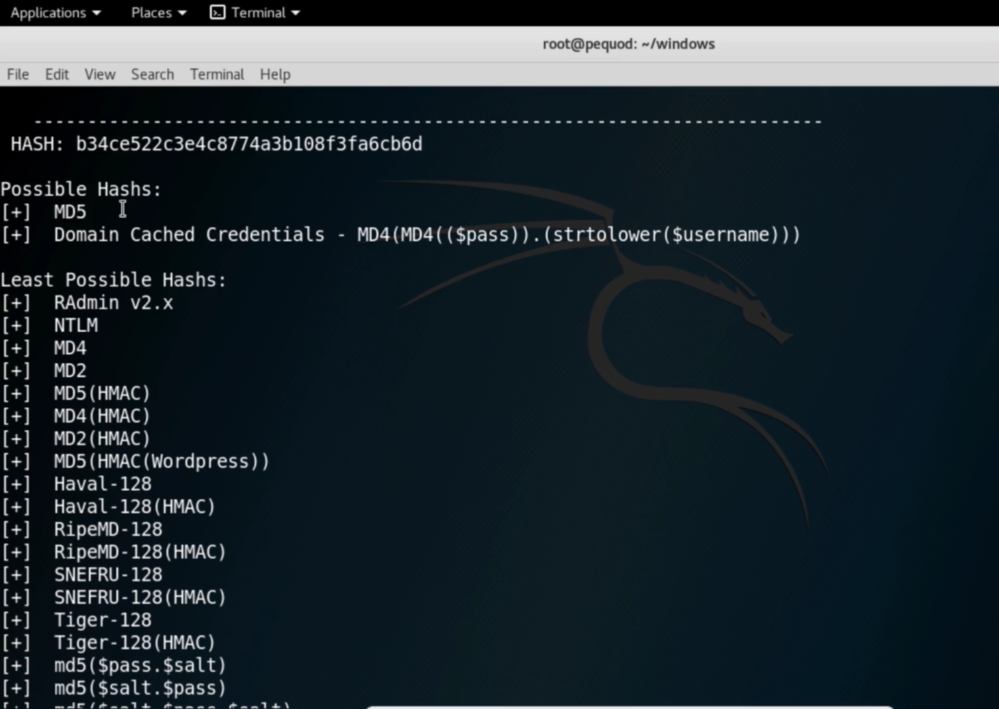
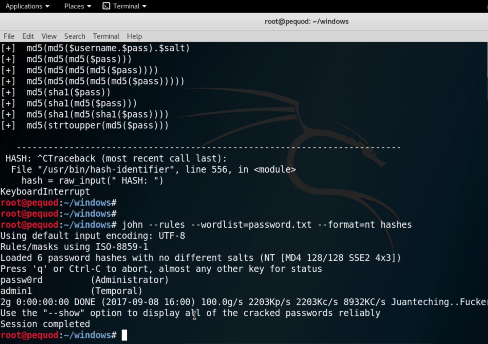

# Windows
En windows podemos dar <kbd>Windows</kbd>+<kbd>r</kbd> y escribir dentro de la ventana `regedit`

El registro organizado por un grupo de llaves y subllaves

Fundamentalmente hablamos de 4 llaves principales, son SAM, SECURITY, SOFTWARE, SYSTEM

Estos archivos se encuentran en la carpeta `C:\WINDOWS\system32\config`
Estos archivos van desde __XP hasta WIN10__

Lo mismo que haciamos con un hashdump en el meterpreter de metasploit es el volcado de el archivo _SAM_

Lo que hacemos es traer el dump de los hashes de windows y los guardamos en una carpeta windows, y dentro de dicho directorio tambien encontraremos el archivo passwords.txt que previamente copiamos de la carpeta medusa

A tener en cuenta el md5 no se calcula unicamente del password

el salt sirve para agregar una cadena aleatoria al password

De nuestro archivo hashes extraemos(copiamos) el hash de administrador

y abrimos `hash-identifier`
luego pegamos el hash e identificamos que tipo de hash es

Podemos notar que lo mas probable es que sea un simple md5 y que tambien hay oportunidad de que sea uno de esos otros de abajo

`john --rules --wordlist=password.txt --format=nt hashes`

* Especificamos que para windows se utiliza el parametro _--format=nt_

