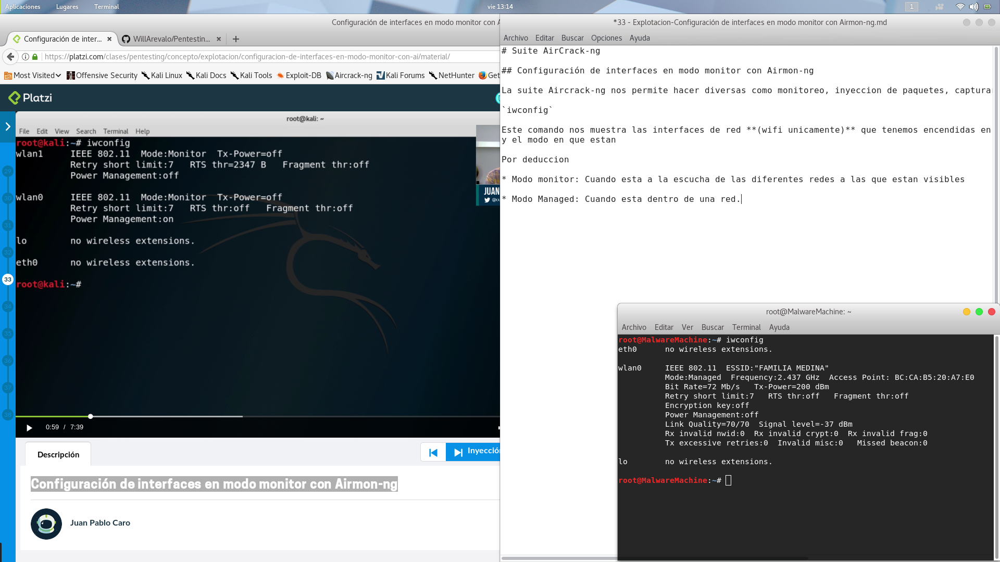
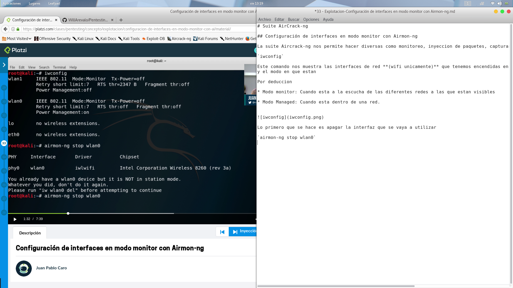
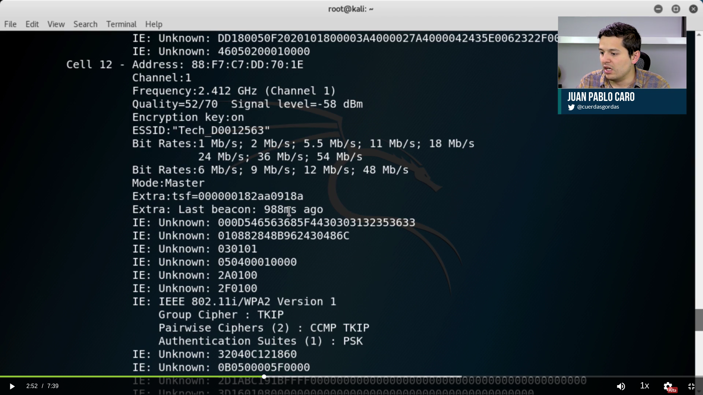

# Suite AirCrack-ng

## Configuración de interfaces en modo monitor con Airmon-ng

La suite Aircrack-ng nos permite hacer diversas como monitoreo, inyeccion de paquetes, capturar paquetes para hacer un ataque directamente a el router

`iwconfig`

Este comando nos muestra las interfaces de red **(wifi unicamente)** que tenemos encendidas en ese momento
y el modo en que estan

Por deduccion

* Modo monitor: Cuando esta a la escucha de las diferentes redes a las que estan visibles

* Modo Managed: Cuando esta dentro de una red.

Lo primero que se hace es apagar la interfaz que se vaya a utilizar

`airmon-ng stop wlan0`

`iwlist wlan0 scan`

Lo que hace este comando es arrojar una lista con las redes disponibles que alcanza nuestra antena

Parametros que recibimos: 

* Address: [Con 6 numeros hexa] esto es la direccion mac del router

* Channel: [numero entre 1 y 16] el canal por donde viaja la frecuencia

* Frecuencia: [numero en decimal que mide la frecuencia] la frecuencia

* Quality= (un numero sobre 70) junto con Signal level= -[numero] dBm Niveles de señal(Aclaracion es mas facil atacar a una red que ese encuentre mas cerca,si la calidad es 70/70 es optima y si el nivel de señal posee un dBm bajo esta en las mejores condiciones.)

* Encryption key: [solo dos estados on | off] Si tiene una llave de encriptacion o es abierta

* ESSID:["Nombre de la red"]

En algunos casos aparece el tipo de cifrado(WEP, WPA, WPA2-AES, WPA2-PSK)

## Poner interfaces en modo monitor

`airmon-ng start wlan0 2`

Esto pone en modo monitor la interfaz wlan0 en el canal 2

Si aparece problemas por procesos que corren y no permiten el comando utilizamos `airmon-ng check kill`

Y volvemos a intentar correr wlan0 en modo monitor

y verificamos que nuestra interfaz halla cambiado de nombre y de modo

