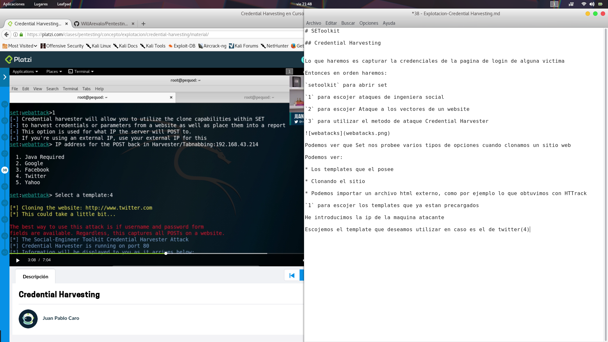
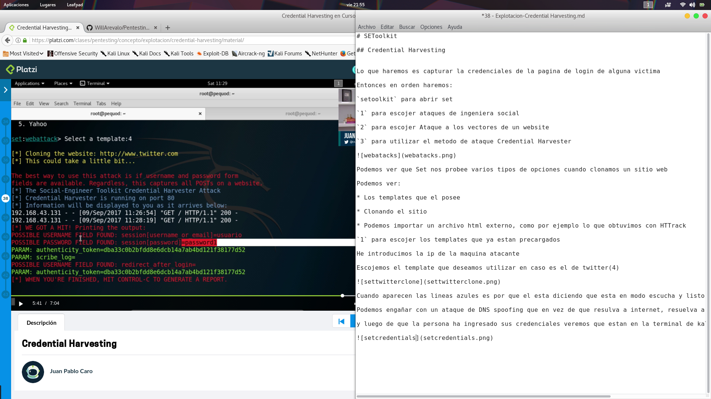

# SEToolkit

## Credential Harvesting

Lo que haremos es capturar la credenciales de la pagina de login de alguna victima

Entonces en orden haremos:

`setoolkit` para abrir set

`1` para escojer ataques de ingeniera social

`2` para escojer Ataque a los vectores de un website

`3` para utilizar el metodo de ataque Credential Harvester

Podemos ver que Set nos probee varios tipos de opciones cuando clonamos un sitio web

Podemos ver:

* Los templates que el posee

* Clonando el sitio

* Podemos importar un archivo html externo, como por ejemplo lo que obtuvimos con HTTrack

`1` para escojer los templates que ya estan precargados

He introducimos la ip de la maquina atacante

Escojemos el template que deseamos utilizar en caso es el de twitter(4)

Cuando aparecen las lineas azules es por que el esta diciendo que esta en modo escucha y listo para recibir

Podemos engañar con un ataque de DNS spoofing que en vez de que resulva a internet, resuelva a la red local, o con un email falso

y luego de que la persona ha ingresado sus credenciales veremos que estan en la terminal de kali en set

