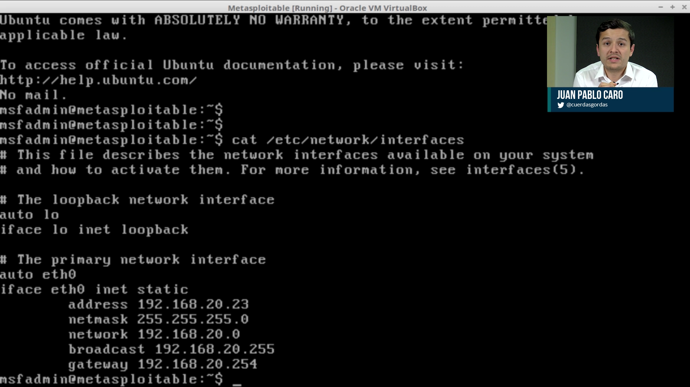

## Se instalan todas las maquinas virtuales

### Configuracion de cada una:

_Kali Linux_(Despues de actulizar)

* Se le cambia la red a interna y se pone como nombre intnet-10

_Debian_(Despues de actulizar sin interfaz grafica)

* Se clona apartir de ella dos maquinas con el nombre router1 y router2 y se utiliza disco enlazado
* En el router1 se cambian a red interna y en la primera interfaz de red se le asigna el nombre de intnet-10 en la segunda interfaz se prende y se le asigna el nombre de intnet-100
* En el router2 se cambian a red interna y en la primera interfaz de red se le asigna el nombre de intnet-100 en la segunda interfaz se prende y se le asigna el nombre de intnet-20
* El login ambos clones vienen de la maquina original
* Se cambia el nombre de host de los clones con el comando _sudo nano /etc/hostname_ y se cambia debian por *router1* y *router2* respectivamente
* Se cambia el archivo hosts de los clones con el comando _sudo nano /etc/hosts_ y se cambia donde dice debian por *router1* y *router2* respectivamente

_Metasploitable_

* Cuadrar la interfaz asi.
