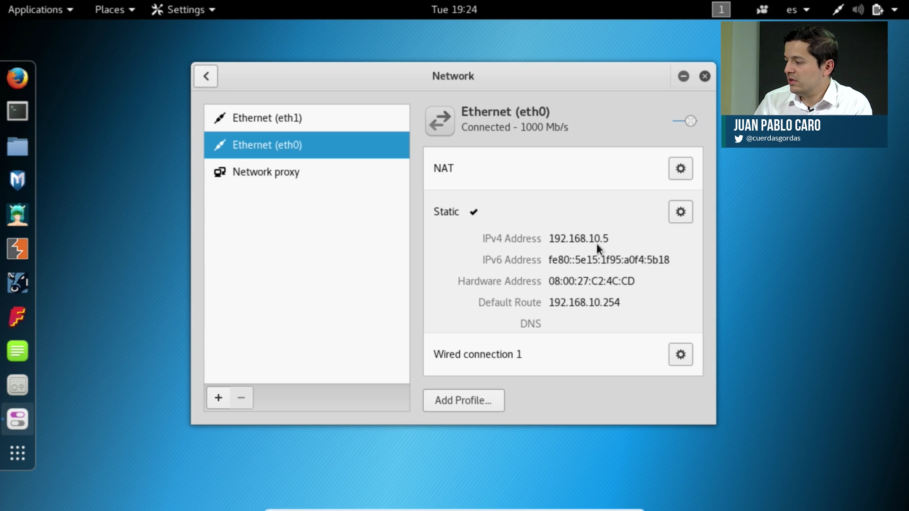
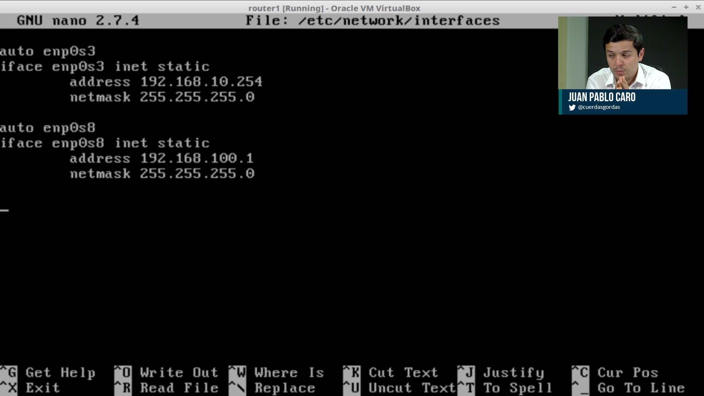

## Se instalan todas las maquinas virtuales

### Configuracion de cada una:

#### _Kali Linux_(Despues de actulizar)

* En virtualBox Se le cambia la red a interna y se pone como nombre intnet-10
* Dentro cambio la interfaz para que quede asi `sudo nano /etc/network/interfaces`

#### _Debian_(Despues de actulizar sin interfaz grafica)

* En virtualBox se clona apartir de ella dos maquinas con el nombre router1 y router2 y se utiliza disco enlazado
* En virtualBox en el router1 se cambian a red interna y en la primera interfaz de red se le asigna el nombre de intnet-10 en la segunda interfaz se prende y se le asigna el nombre de intnet-100
* En virtualBox en el router2 se cambian a red interna y en la primera interfaz de red se le asigna el nombre de intnet-100 en la segunda interfaz se prende y se le asigna el nombre de intnet-20
* El login ambos clones vienen de la maquina original
* Se cambia el nombre de host de los clones con el comando `sudo nano /etc/hostname` y se cambia debian por *router1* y *router2* respectivamente
* Se cambia el archivo hosts de los clones con el comando `sudo nano /etc/hosts` y se cambia donde dice debian por *router1* y *router2* respectivamente
* Dentro cambio la interfaz para que quede asi para el rputer1

* Para el router 2 asi

Configuracion del router2

auto enp0s3
iface enp0s3 inet static
address 192.168.100.2
netmask 255.255.255.0

auto enp0s8
iface enp0s8 inet static
address 192.168.20.254
netmask 255.255.255.0

up ip route 192.168.10.0/24 via 192.168.100.1 dev enp0s3

* Luego mandamos a que funcione como router y redirija `sudo nano /proc/sys/net/ipv4/ip_forward` y dentro escribimos un "1" para activarlo

#### _Metasploitable_

* Cuadrar la interfaz asi.
